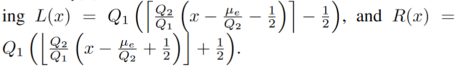

# ADJPEG algorithm

Formulas are taken from the [paper](https://ieeexplore.ieee.org/document/6151134) by Bianchi and Piva.

## Primary Compression (Q1) estimation

### probability distribution for non-double-quantized DC coefficients

pNDQ describes the probability distribution of a quantized DCT value $x$ to be part of the original distribution $p_0$, when quantized with quantization step $Q_2$.

$$p_\text{NDQ}(x;Q_2)=\sum^{Q_2x+Q_2/2}_{v=Q_2x-Q_2/2}p_o(v)$$

This is already in the simplified model. However, we do not have access to $p_0$ in a real-world environment. In a previous [paper](https://ieeexplore.ieee.org/document/5946978) this approximation is done by recompression a cropped version of the tampered image with $Q_2$ to get $\tilde{h}(x)$.

$$p(x|\mathcal{H}_0)=\tilde{h}(x)$$

### probability distribution for double-quantized DC coefficients

pDQ describes an approximated probability distribution for quantized DTC value $x$ with quantization steps $Q_1$ and $Q_2$.

$$p_\text{DQ}(x;Q_1,Q_2) \approx n_\text{DQ}(x) \cdot p_\text{NDQ}(x;Q_2), x \neq 0$$

$$n_\text{DQ}(x) = (R(x)-L(x))/Q_2 > 0$$

We cannot calculate the values for L and R, because they are dependent on $Q_1$, so we again have to find an approximation. We can again use one from the previous paper:

$$L'(x) = Q_2x-\dfrac{Q_2}{2}, R'(x) = Q_2x+\dfrac{Q_2}{2}$$

This is still rather far off the actual model (see figure), but this is something that has to be tried out.

The r/t error using the actual fft and ifft is not feasible as the entire 8x8 block has to be converted, with each quantization step having a latent effect on the rounding and truncating of the single values.
